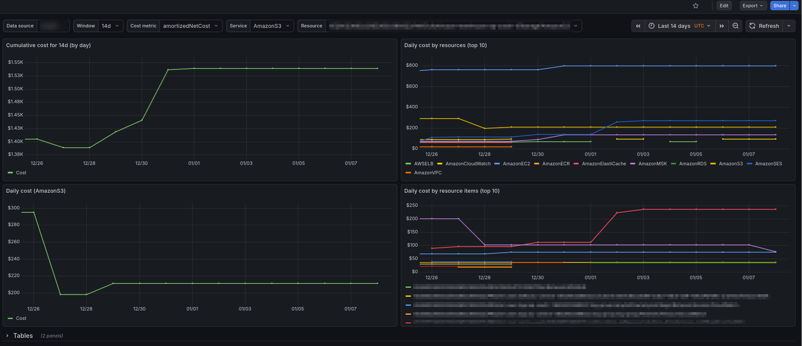

# Grafana dashboards (OpenCost)

This folder contains Grafana dashboards used with OpenCost.

## Dashboards included

- **Overview (OpenCost)**: `opencost-k8s-cluster-overview.json`  
  Based on the community dashboard: [22208 - OpenCost / Overview](https://grafana.com/grafana/dashboards/22208-opencost-overview/).

- **Namespace (OpenCost)**: `22252_rev3_opencost_namespace_dash.json`  
  Based on the community dashboard: [22252 - OpenCost / Namespace](https://grafana.com/grafana/dashboards/22252-opencost-namespace/).

- **Cloud Costs (Prometheus Exporter)**: `opencost_cloud_costs_view.json`  
  Custom dashboard for cloud costs coming from the `cloud_costs_exporter` Prometheus metrics (daily + window totals).

## Import / update in Grafana

- **Manual import**: Grafana → *Dashboards* → *New* → *Import* → upload the JSON file.
- **Datasource**: set the dashboard datasource variable (usually `prometheus`/VictoriaMetrics Prometheus API endpoint).

## Notes (Cloud Costs dashboard)

- The dashboard expects the `opencost_cloudcost_*` metrics emitted by the Cloud Costs exporter.
- Daily series are sparse (one sample per day); the dashboard queries are written to work with this and keep top‑10 selections stable.
- If you use **VictoriaMetrics `vmagent`** to scrape the exporter, ensure your `scrape_config` has `honor_timestamps: true` (vmagent ignores target-provided timestamps by default in newer versions). Otherwise daily points will get the scrape time and panels will look wrong.

## Screenshot (Cloud Costs dashboard)

